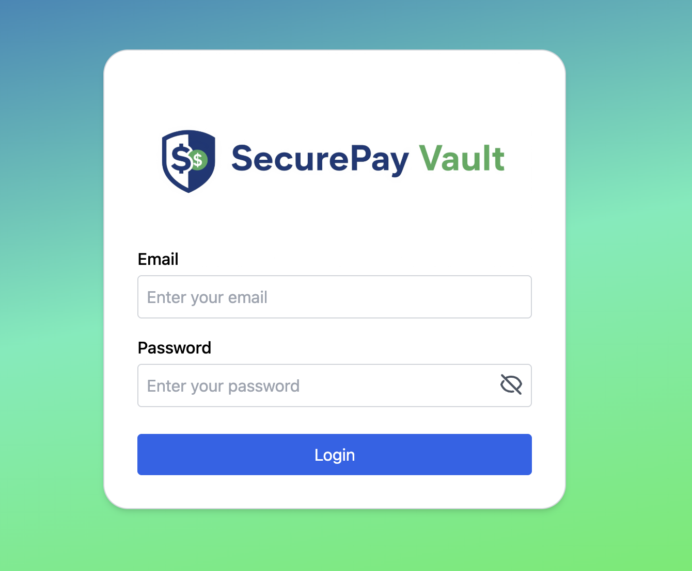
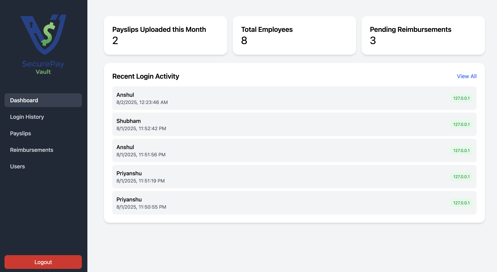
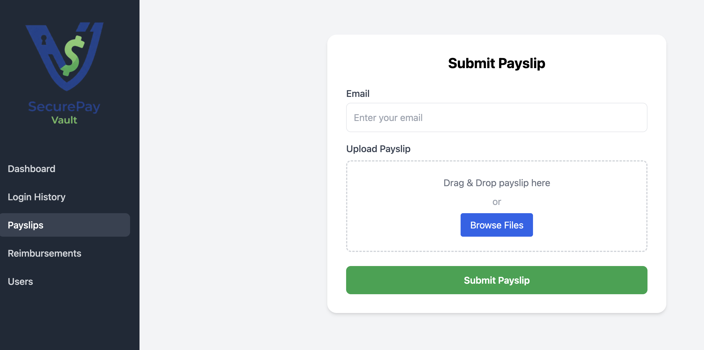
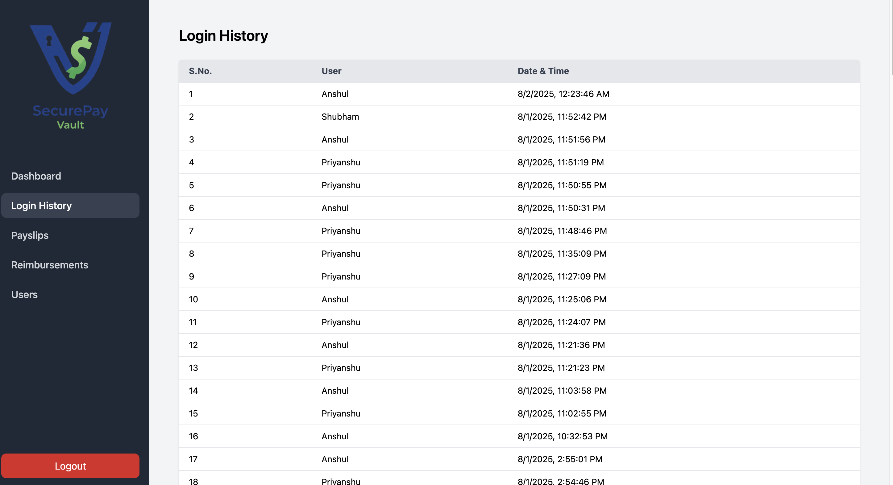
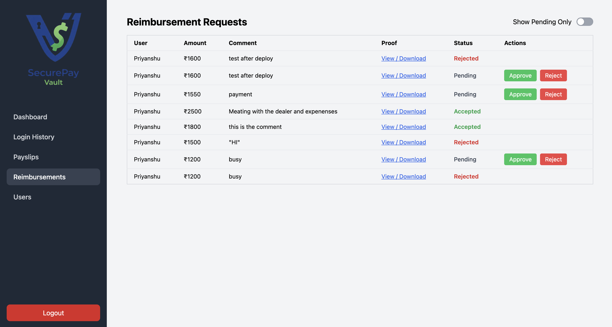
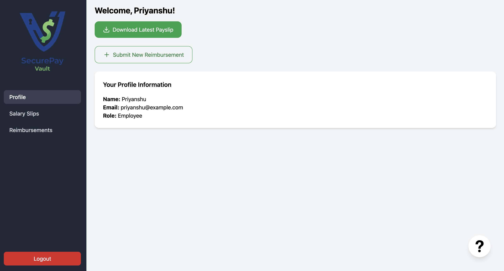
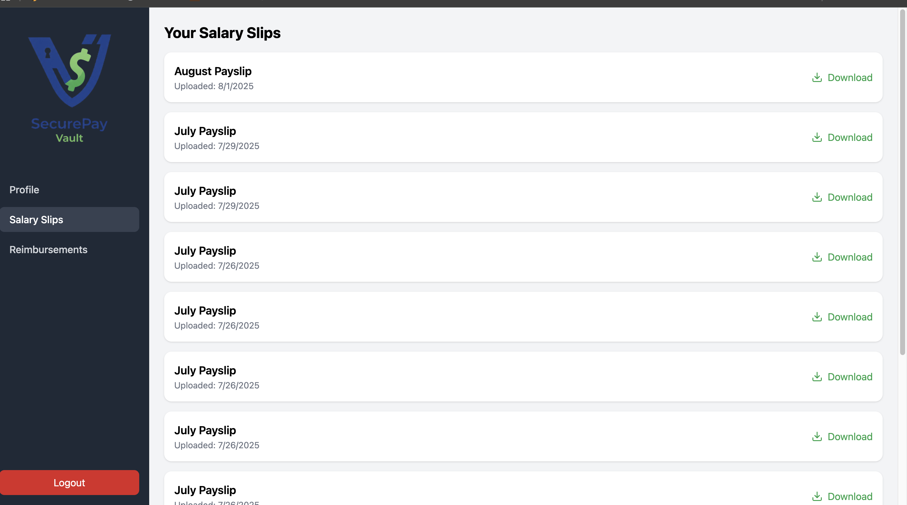
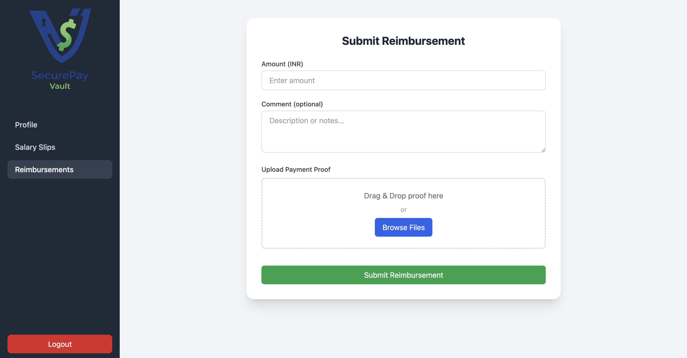

# 💼 SecurePay Vault

SecurePay Vault is a full-stack role-based fintech platform built using the MERN stack. It allows Admins to upload payslips, track login activity, and manage reimbursements, while Users can securely view/download payslips and submit reimbursement requests.

🔗 **Live Website**: [SecurePay Vault](https://securepay-vault.vercel.app/)

---

## 🚀 Features

- Role-based authentication using JWT
- Admin dashboard to upload payslips, manage reimbursements, and view login logs
- User dashboard to view/download payslips and submit reimbursement requests
- Cloudinary integration for file uploads
- Secure API routes with Express and MongoDB
- Responsive frontend with React and TailwindCSS

---

## 🛠️ Tech Stack

**Frontend**: React.js, Tailwind CSS, Axios, React Router  
**Backend**: Node.js, Express.js, MongoDB, Mongoose, JWT, Multer, Cloudinary  
**Database**: MongoDB Atlas  
**File Uploads**: Cloudinary  
**Deployment**: Vercel (frontend), Render/Railway (backend)

---

## 📸 Screenshots (stored in `screenshots/` folder)

### 1️⃣ Login Page  


### 2️⃣ Admin Homepage  


### 3️⃣ Upload Payslips (Admin)  


### 4️⃣ Login History (Admin)  


### 5️⃣ Reimbursement Management (Admin)  


### 6️⃣ User Homepage  


### 7️⃣ Payslip View (User)  


### 8️⃣ Submit Reimbursement (User)  



---

## ⚙️ Run Locally

```bash
# Clone the repo
git clone https://github.com/Anshul0K/SecureVault
cd SecurePay-Vault

# Backend setup
cd Backend
npm install
# Create backend/.env file
# Example .env
# MONGO_URI=your_mongo_url
# JWT_SECRET=your_jwt_secret
# CLOUDINARY_CLOUD_NAME=your_cloud_name
# CLOUDINARY_API_KEY=your_api_key
# CLOUDINARY_API_SECRET=your_api_secret
npm run dev

# Frontend setup
cd ../Frontend
npm install
# Create frontend/.env file
# Example .env
# VITE_API_BASE_URL=http://localhost:4000
npm run dev

```

---

## ✍️ Author

**Anshul Kumar**  
🎓 B.Tech CSAI, Netaji Subhas University of Technology (NSUT)  
💻 GitHub: [@Anshul0K](https://github.com/Anshul0K)  
